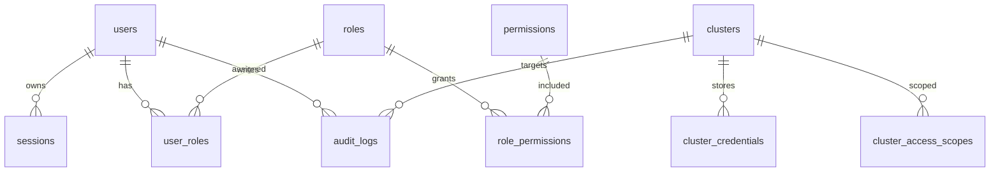

# 数据库设计

## 1. 文档信息

- 项目名称：kube-subops
- 文档版本：1.0.0
- 作者：Codex
- 创建日期：2026-05-27
- 最后更新日期：2026-05-27
- 文档状态：已确认
- 关联架构文档：`spec/架构设计.md`
- 关联 API 文档：`spec/API设计.md`
- 关联 UI 文档：`spec/UI原型设计.md`
- 关联模板事实源：待 `/ui` 确认

## 2. 设计说明

### 设计目标

- 目标 1：持久化平台用户、角色、权限、会话、集群配置、加密凭据、访问范围、审计日志和系统设置。
- 目标 2：保证敏感凭据密文保存，明文仅在后端内存中短暂解密使用。
- 目标 3：以显式 SQL、迁移和类型生成为后端实现提供稳定契约。

### 范围

- 涉及业务域：内置账号、平台 RBAC、多集群管理、集群凭据、安全会话、审计日志、系统设置。
- 涉及表：`users`、`roles`、`permissions`、`user_roles`、`role_permissions`、`clusters`、`cluster_credentials`、`cluster_access_scopes`、`sessions`、`audit_logs`、`system_settings`。
- 不包含内容：Kubernetes 资源对象持久化、Secret 明文持久化、外部 SSO、外部审计、备份恢复记录、对象存储配置。

### 存储方案

- 数据库类型：关系型数据库。
- 开发数据库：SQLite。
- 生产目标数据库：v1.0 仍为 SQLite 单实例；PostgreSQL 作为后续生产增强方向。
- 版本：SQLite 精确版本由后端依赖和运行镜像确认。
- 字符集：UTF-8。
- ORM / SQL 管理方式：sqlc 生成类型安全查询代码，业务 SQL 显式维护。
- 迁移方式：goose 管理迁移脚本。
- 迁移触发条件：表结构、索引、枚举、审计字段、权限字段或持久化规则变化。
- SQLite -> PostgreSQL 兼容约束：避免依赖 SQLite 专属类型宽松、隐式布尔、非标准 JSON 查询、非标准 upsert 细节和弱外键默认行为；所有外键必须显式启用并验证。
- 数据库专属行为限制：v1.0 不承诺 PostgreSQL 双库运行，不提前使用 PostgreSQL 专属特性。
- 迁移验证方式：后端实现阶段执行 goose 迁移、基础 seed、关键读写 smoke；后续迁移 PostgreSQL 时补充迁移验证任务。

### 契约边界

- API 契约来源：`spec/API设计.md`
- 模板 facts 影响范围：仅影响前端请求、Mock 和 adapter 接入，不把模板 demo 表或字段作为数据库事实源。
- 前端可见字段边界：用户、角色、集群、审计等通过 API DTO 暴露脱敏字段。
- 不进入数据库的前端 view model / adapter 字段：表格展示状态、临时筛选条件、展开状态、终端会话 UI 状态。
- 不作为业务事实源的模板 demo 数据：模板自带用户、菜单、角色、日志、配置示例均不作为本项目数据库事实。

## 3. 设计规范

### 命名规范

- 表命名：小写复数蛇形命名，例如 `audit_logs`。
- 字段命名：小写蛇形命名，例如 `created_at`。
- 索引命名：`idx_<table>_<fields>`；唯一索引使用 `uidx_<table>_<fields>`。

### 通用约定

- 主键策略：文本 ID 或整数自增由实现阶段统一；对外 API 不暴露数据库自增假设。
- 时间字段：统一使用 UTC 时间，字段名为 `created_at`、`updated_at`、`expires_at` 等。
- 逻辑删除：用户、角色、集群可采用 `deleted_at`；审计日志不逻辑删除，只按保留策略清理。
- 审计字段：核心配置表保留创建和更新时间；操作审计写入 `audit_logs`。
- 状态字段约定：使用稳定字符串枚举，例如 `active`、`disabled`、`success`、`failed`。
- 敏感字段约定：凭据只保存密文、nonce、key version 和凭据类型；密码只保存哈希。
- 枚举与字典来源：权限点、风险级别、操作类型由后端常量和数据库 seed 同步维护。
- API DTO 与数据库字段映射约定：API 只返回脱敏 DTO，不直接透出密文字段、密码哈希或内部 nonce。
- 前端查询 / 排序字段白名单：用户、集群、审计日志等平台数据只允许后端白名单字段查询和排序。

## 4. 数据对象总览

| 数据对象 / 表名 | 用途 | 关键关系 | 关联 API 契约 ID | 前端可见字段摘要 | 读写特点 | 数据敏感性 |
|------------------|------|----------|------------------|------------------|----------|------------|
| users | 平台用户 | 与 roles 多对多，与 sessions 一对多 | API-001、API-003、API-021 | id、username、displayName、status、roles | 登录、用户管理 | 敏感 |
| roles | 平台角色 | 与 users、permissions 多对多 | API-003、API-022 | id、name、description、builtIn | 角色管理 | 普通 |
| permissions | 权限点 | 与 roles 多对多 | API-003、API-022 | id、code、name、resource、action | seed + 配置 | 普通 |
| user_roles | 用户角色绑定 | users 与 roles 关联 | API-021、API-022 | 通过 DTO 展示 | 写少读多 | 普通 |
| role_permissions | 角色权限绑定 | roles 与 permissions 关联 | API-022 | 通过 DTO 展示 | 写少读多 | 普通 |
| clusters | 集群配置 | 与 credentials、access_scopes、audit_logs 关联 | API-004、API-005、API-006 | id、name、apiServer、status、description | 配置读写 | 敏感 |
| cluster_credentials | 集群凭据密文 | clusters 一对一或一对多 | API-005、API-006 | 只展示脱敏摘要 | 高敏写入 | 高敏 |
| cluster_access_scopes | 集群 / Namespace 授权范围 | users / roles 与 clusters 关联 | API-003、API-008 | 授权范围摘要 | 权限判断高频读取 | 敏感 |
| sessions | 服务端会话 | users 一对多 | API-001、API-002、API-003 | 不直接展示 | 登录高频读写 | 敏感 |
| audit_logs | 操作审计 | 关联 users、clusters | API-023 | 操作、结果、时间、用户、资源 | 写多读多 | 敏感 |
| system_settings | 系统设置 | 独立配置项 | API-024 | key、value 摘要、更新时间 | 写少读多 | 敏感 |

## 5. 表结构设计

### users

#### 用途说明

保存平台内置账号，用于登录、权限归属和审计主体。

#### 字段定义

| 字段 | 类型 | 必填 | 默认值 | 索引 | API / DTO 映射 | 前端可见 | 说明 |
|------|------|------|--------|------|----------------|----------|------|
| id | text | 是 | - | PK | id | 是 | 用户 ID |
| username | text | 是 | - | UNIQUE | username | 是 | 登录名 |
| display_name | text | 是 | - | - | displayName | 是 | 展示名 |
| password_hash | text | 是 | - | - | 不暴露 | 否 | 密码哈希 |
| status | text | 是 | active | idx_users_status | status | 是 | active / disabled |
| last_login_at | datetime | 否 | null | - | lastLoginAt | 是 | 最后登录时间 |
| created_at | datetime | 是 | now | - | createdAt | 是 | 创建时间 |
| updated_at | datetime | 是 | now | - | updatedAt | 是 | 更新时间 |
| deleted_at | datetime | 否 | null | idx_users_deleted_at | 不暴露 | 否 | 逻辑删除 |

#### 约束说明

- 主键：`id`
- 唯一约束：`username`
- 外键约束：由 `user_roles.user_id`、`sessions.user_id`、`audit_logs.user_id` 引用
- 业务约束：禁用用户不能登录；删除用户前需处理会话和角色绑定

#### 索引设计

| 索引名 | 字段 | 类型 | 用途 |
|--------|------|------|------|
| uidx_users_username | username | UNIQUE | 登录名唯一 |
| idx_users_status | status | NORMAL | 用户筛选 |
| idx_users_deleted_at | deleted_at | NORMAL | 逻辑删除过滤 |

#### 关联关系

- 关联表：`roles`、`sessions`、`audit_logs`
- 关系类型：用户与角色多对多，用户与会话一对多，用户与审计一对多
- 关联字段：`users.id`

#### 读写规则

- 创建：管理员创建或初始化默认管理员。
- 更新：允许更新展示名、状态、密码。
- 删除：逻辑删除，保留审计引用。
- 查询：按用户名、状态分页查询。

#### 关联接口与契约

- 关联 API：API-001、API-003、API-021
- 契约约束：不返回 `password_hash`。
- 字段映射：`display_name` -> `displayName`。
- 查询 / 排序映射：username、status、created_at。
- 状态枚举映射：active、disabled。
- 权限与数据范围：用户管理权限。
- 模板 facts 相关约束：待 `/ui` 回填。

### roles

#### 用途说明

保存平台角色，包括内置管理员、运维、只读用户和自定义角色。

#### 字段定义

| 字段 | 类型 | 必填 | 默认值 | 索引 | API / DTO 映射 | 前端可见 | 说明 |
|------|------|------|--------|------|----------------|----------|------|
| id | text | 是 | - | PK | id | 是 | 角色 ID |
| name | text | 是 | - | UNIQUE | name | 是 | 角色名称 |
| description | text | 否 | null | - | description | 是 | 描述 |
| built_in | boolean | 是 | false | - | builtIn | 是 | 是否内置角色 |
| created_at | datetime | 是 | now | - | createdAt | 是 | 创建时间 |
| updated_at | datetime | 是 | now | - | updatedAt | 是 | 更新时间 |
| deleted_at | datetime | 否 | null | idx_roles_deleted_at | 不暴露 | 否 | 逻辑删除 |

#### 约束说明

- 主键：`id`
- 唯一约束：`name`
- 外键约束：由 `user_roles.role_id`、`role_permissions.role_id` 引用
- 业务约束：内置角色不可删除，可限制修改关键权限

#### 索引设计

| 索引名 | 字段 | 类型 | 用途 |
|--------|------|------|------|
| uidx_roles_name | name | UNIQUE | 角色名唯一 |
| idx_roles_deleted_at | deleted_at | NORMAL | 逻辑删除过滤 |

#### 关联关系

- 关联表：`users`、`permissions`
- 关系类型：多对多
- 关联字段：`roles.id`

#### 读写规则

- 创建：管理员创建自定义角色。
- 更新：允许编辑名称、描述、权限绑定。
- 删除：逻辑删除非内置角色。
- 查询：按名称分页查询。

#### 关联接口与契约

- 关联 API：API-003、API-022
- 权限与数据范围：角色管理权限。

### permissions

#### 用途说明

保存平台权限点，支撑菜单可见、按钮操作、后端鉴权和审计。

#### 字段定义

| 字段 | 类型 | 必填 | 默认值 | 索引 | API / DTO 映射 | 前端可见 | 说明 |
|------|------|------|--------|------|----------------|----------|------|
| id | text | 是 | - | PK | id | 是 | 权限 ID |
| code | text | 是 | - | UNIQUE | code | 是 | 权限编码 |
| name | text | 是 | - | - | name | 是 | 权限名称 |
| resource | text | 是 | - | idx_permissions_resource | resource | 是 | 资源域 |
| action | text | 是 | - | idx_permissions_action | action | 是 | 操作 |
| risk_level | text | 是 | low | - | riskLevel | 是 | low / medium / high |
| created_at | datetime | 是 | now | - | createdAt | 是 | 创建时间 |

#### 约束说明

- 主键：`id`
- 唯一约束：`code`
- 外键约束：由 `role_permissions.permission_id` 引用
- 业务约束：权限点由后端 seed 初始化，避免前端临时发明权限编码

#### 索引设计

| 索引名 | 字段 | 类型 | 用途 |
|--------|------|------|------|
| uidx_permissions_code | code | UNIQUE | 权限编码唯一 |
| idx_permissions_resource | resource | NORMAL | 资源域查询 |
| idx_permissions_action | action | NORMAL | 操作查询 |

#### 关联关系

- 关联表：`roles`
- 关系类型：多对多
- 关联字段：`permissions.id`

#### 读写规则

- 创建：后端 seed。
- 更新：一般不开放业务编辑。
- 删除：不建议删除，废弃时由后端版本迁移处理。
- 查询：按资源域分组返回。

#### 关联接口与契约

- 关联 API：API-003、API-022

### user_roles

#### 用途说明

保存用户和角色绑定关系。

#### 字段定义

| 字段 | 类型 | 必填 | 默认值 | 索引 | API / DTO 映射 | 前端可见 | 说明 |
|------|------|------|--------|------|----------------|----------|------|
| user_id | text | 是 | - | PK, FK | userId | 否 | 用户 ID |
| role_id | text | 是 | - | PK, FK | roleId | 否 | 角色 ID |
| created_at | datetime | 是 | now | - | createdAt | 否 | 创建时间 |

#### 约束说明

- 主键：`user_id, role_id`
- 唯一约束：同主键
- 外键约束：`user_id -> users.id`，`role_id -> roles.id`
- 业务约束：用户至少保留必要角色或权限

#### 索引设计

| 索引名 | 字段 | 类型 | 用途 |
|--------|------|------|------|
| idx_user_roles_role_id | role_id | NORMAL | 按角色查询用户 |

#### 关联关系

- 关联表：`users`、`roles`
- 关系类型：多对多关联表
- 关联字段：`user_id`、`role_id`

#### 读写规则

- 创建：为用户绑定角色。
- 更新：以删除后新增的方式调整。
- 删除：解绑角色。
- 查询：用户详情、角色详情聚合读取。

#### 关联接口与契约

- 关联 API：API-021、API-022

### role_permissions

#### 用途说明

保存角色与权限点绑定关系。

#### 字段定义

| 字段 | 类型 | 必填 | 默认值 | 索引 | API / DTO 映射 | 前端可见 | 说明 |
|------|------|------|--------|------|----------------|----------|------|
| role_id | text | 是 | - | PK, FK | roleId | 否 | 角色 ID |
| permission_id | text | 是 | - | PK, FK | permissionId | 否 | 权限 ID |
| created_at | datetime | 是 | now | - | createdAt | 否 | 创建时间 |

#### 约束说明

- 主键：`role_id, permission_id`
- 外键约束：`role_id -> roles.id`，`permission_id -> permissions.id`
- 业务约束：内置角色默认权限由 seed 初始化

#### 索引设计

| 索引名 | 字段 | 类型 | 用途 |
|--------|------|------|------|
| idx_role_permissions_permission_id | permission_id | NORMAL | 查找拥有某权限的角色 |

#### 关联关系

- 关联表：`roles`、`permissions`
- 关系类型：多对多关联表
- 关联字段：`role_id`、`permission_id`

#### 读写规则

- 创建：绑定权限。
- 更新：以删除后新增方式调整。
- 删除：解绑权限。
- 查询：角色详情和当前用户权限聚合读取。

#### 关联接口与契约

- 关联 API：API-003、API-022

### clusters

#### 用途说明

保存 Kubernetes 集群连接配置和展示信息。

#### 字段定义

| 字段 | 类型 | 必填 | 默认值 | 索引 | API / DTO 映射 | 前端可见 | 说明 |
|------|------|------|--------|------|----------------|----------|------|
| id | text | 是 | - | PK | id | 是 | 集群 ID |
| name | text | 是 | - | UNIQUE | name | 是 | 集群名称 |
| api_server | text | 是 | - | - | apiServer | 是 | API Server 地址，可脱敏展示 |
| description | text | 否 | null | - | description | 是 | 描述 |
| status | text | 是 | unknown | idx_clusters_status | status | 是 | connected / failed / unknown |
| last_checked_at | datetime | 否 | null | - | lastCheckedAt | 是 | 最近连接测试时间 |
| created_at | datetime | 是 | now | - | createdAt | 是 | 创建时间 |
| updated_at | datetime | 是 | now | - | updatedAt | 是 | 更新时间 |
| deleted_at | datetime | 否 | null | idx_clusters_deleted_at | 不暴露 | 否 | 逻辑删除 |

#### 约束说明

- 主键：`id`
- 唯一约束：`name`
- 外键约束：由 `cluster_credentials.cluster_id`、`cluster_access_scopes.cluster_id`、`audit_logs.cluster_id` 引用
- 业务约束：删除集群前应处理凭据和授权范围

#### 索引设计

| 索引名 | 字段 | 类型 | 用途 |
|--------|------|------|------|
| uidx_clusters_name | name | UNIQUE | 集群名唯一 |
| idx_clusters_status | status | NORMAL | 状态筛选 |
| idx_clusters_deleted_at | deleted_at | NORMAL | 逻辑删除过滤 |

#### 关联关系

- 关联表：`cluster_credentials`、`cluster_access_scopes`、`audit_logs`
- 关系类型：一对多
- 关联字段：`clusters.id`

#### 读写规则

- 创建：添加集群配置并保存加密凭据。
- 更新：允许修改名称、描述、API Server 和凭据。
- 删除：逻辑删除集群并停用凭据。
- 查询：按名称、状态分页查询。

#### 关联接口与契约

- 关联 API：API-004、API-005、API-006

### cluster_credentials

#### 用途说明

保存集群连接凭据密文，支持 kubeconfig、Token、ServiceAccount Token。

#### 字段定义

| 字段 | 类型 | 必填 | 默认值 | 索引 | API / DTO 映射 | 前端可见 | 说明 |
|------|------|------|--------|------|----------------|----------|------|
| id | text | 是 | - | PK | id | 否 | 凭据 ID |
| cluster_id | text | 是 | - | FK, idx_cluster_credentials_cluster_id | clusterId | 否 | 集群 ID |
| credential_type | text | 是 | - | - | credentialType | 是 | kubeconfig / token / service_account_token |
| encrypted_payload | blob | 是 | - | - | 不暴露 | 否 | AES-GCM 密文 |
| nonce | blob | 是 | - | - | 不暴露 | 否 | AES-GCM nonce |
| key_version | text | 是 | default | - | 不暴露 | 否 | 主密钥版本 |
| fingerprint | text | 否 | null | idx_cluster_credentials_fingerprint | fingerprint | 是 | 脱敏指纹 |
| created_at | datetime | 是 | now | - | createdAt | 是 | 创建时间 |
| updated_at | datetime | 是 | now | - | updatedAt | 是 | 更新时间 |

#### 约束说明

- 主键：`id`
- 唯一约束：可按实现约束每个集群一个当前凭据
- 外键约束：`cluster_id -> clusters.id`
- 业务约束：不保存明文；主密钥缺失时后端不得启动或不得执行凭据解密操作

#### 索引设计

| 索引名 | 字段 | 类型 | 用途 |
|--------|------|------|------|
| idx_cluster_credentials_cluster_id | cluster_id | NORMAL | 按集群读取凭据 |
| idx_cluster_credentials_fingerprint | fingerprint | NORMAL | 凭据变更审计辅助 |

#### 关联关系

- 关联表：`clusters`
- 关系类型：多对一
- 关联字段：`cluster_id`

#### 读写规则

- 创建：后端使用环境主密钥 AES-GCM 加密后写入。
- 更新：重新加密并更新 key version、nonce 和指纹。
- 删除：随集群逻辑删除或凭据轮换清理。
- 查询：仅后端内部读取密文并短暂解密。

#### 关联接口与契约

- 关联 API：API-005、API-006
- 权限与数据范围：集群管理权限。

### cluster_access_scopes

#### 用途说明

保存平台 RBAC 中用户或角色对集群、Namespace、资源范围的授权。

#### 字段定义

| 字段 | 类型 | 必填 | 默认值 | 索引 | API / DTO 映射 | 前端可见 | 说明 |
|------|------|------|--------|------|----------------|----------|------|
| id | text | 是 | - | PK | id | 是 | 授权 ID |
| subject_type | text | 是 | - | idx_cluster_access_subject | subjectType | 是 | user / role |
| subject_id | text | 是 | - | idx_cluster_access_subject | subjectId | 是 | 用户或角色 ID |
| cluster_id | text | 是 | - | FK, idx_cluster_access_cluster | clusterId | 是 | 集群 ID |
| namespace_pattern | text | 否 | null | - | namespacePattern | 是 | Namespace 范围，空表示集群级 |
| resource_pattern | text | 否 | null | - | resourcePattern | 是 | 资源范围 |
| created_at | datetime | 是 | now | - | createdAt | 是 | 创建时间 |

#### 约束说明

- 主键：`id`
- 外键约束：`cluster_id -> clusters.id`
- 业务约束：授权范围必须由后端解释，不能由前端自行判断。

#### 索引设计

| 索引名 | 字段 | 类型 | 用途 |
|--------|------|------|------|
| idx_cluster_access_subject | subject_type, subject_id | NORMAL | 查询主体授权 |
| idx_cluster_access_cluster | cluster_id | NORMAL | 查询集群授权 |

#### 关联关系

- 关联表：`users` / `roles`、`clusters`
- 关系类型：主体到集群范围的多对多授权
- 关联字段：`subject_id`、`cluster_id`

#### 读写规则

- 创建：管理员配置授权范围。
- 更新：以删除后新增方式调整。
- 删除：取消授权。
- 查询：鉴权时高频读取，可在后端会话上下文中缓存短期结果。

#### 关联接口与契约

- 关联 API：API-003、API-021、API-022

### sessions

#### 用途说明

保存服务端登录会话，支持退出、撤销和过期控制。

#### 字段定义

| 字段 | 类型 | 必填 | 默认值 | 索引 | API / DTO 映射 | 前端可见 | 说明 |
|------|------|------|--------|------|----------------|----------|------|
| id | text | 是 | - | PK | 不暴露 | 否 | 会话 ID，Cookie 中传递 |
| user_id | text | 是 | - | FK, idx_sessions_user_id | userId | 否 | 用户 ID |
| ip_address | text | 否 | null | - | 不暴露 | 否 | 登录 IP |
| user_agent | text | 否 | null | - | 不暴露 | 否 | User-Agent |
| expires_at | datetime | 是 | - | idx_sessions_expires_at | 不暴露 | 否 | 过期时间 |
| revoked_at | datetime | 否 | null | idx_sessions_revoked_at | 不暴露 | 否 | 撤销时间 |
| created_at | datetime | 是 | now | - | 不暴露 | 否 | 创建时间 |
| updated_at | datetime | 是 | now | - | 不暴露 | 否 | 更新时间 |

#### 约束说明

- 主键：`id`
- 外键约束：`user_id -> users.id`
- 业务约束：过期或撤销会话不可继续访问 API

#### 索引设计

| 索引名 | 字段 | 类型 | 用途 |
|--------|------|------|------|
| idx_sessions_user_id | user_id | NORMAL | 用户会话查询 |
| idx_sessions_expires_at | expires_at | NORMAL | 清理过期会话 |
| idx_sessions_revoked_at | revoked_at | NORMAL | 查询撤销状态 |

#### 关联关系

- 关联表：`users`
- 关系类型：多对一
- 关联字段：`user_id`

#### 读写规则

- 创建：登录成功创建会话。
- 更新：按需刷新更新时间。
- 删除：可物理清理过期会话。
- 查询：每次 API 请求按 session id 校验。

#### 关联接口与契约

- 关联 API：API-001、API-002、API-003

### audit_logs

#### 用途说明

保存平台操作审计记录，用于追踪登录、集群连接、资源写操作和高风险操作。

#### 字段定义

| 字段 | 类型 | 必填 | 默认值 | 索引 | API / DTO 映射 | 前端可见 | 说明 |
|------|------|------|--------|------|----------------|----------|------|
| id | text | 是 | - | PK | id | 是 | 审计 ID |
| request_id | text | 是 | - | idx_audit_logs_request_id | requestId | 是 | 请求 ID |
| user_id | text | 否 | null | idx_audit_logs_user_id | userId | 是 | 用户 ID |
| username | text | 否 | null | - | username | 是 | 用户名快照 |
| cluster_id | text | 否 | null | idx_audit_logs_cluster_id | clusterId | 是 | 集群 ID |
| namespace | text | 否 | null | idx_audit_logs_namespace | namespace | 是 | Namespace |
| resource_type | text | 否 | null | idx_audit_logs_resource | resourceType | 是 | 资源类型 |
| resource_name | text | 否 | null | idx_audit_logs_resource | resourceName | 是 | 资源名称 |
| action | text | 是 | - | idx_audit_logs_action | action | 是 | 操作 |
| risk_level | text | 是 | low | idx_audit_logs_risk_level | riskLevel | 是 | 风险级别 |
| confirmed | boolean | 是 | false | - | confirmed | 是 | 是否二次确认 |
| result | text | 是 | - | idx_audit_logs_result | result | 是 | success / failed |
| error_message | text | 否 | null | - | errorMessage | 是 | 脱敏错误原因 |
| ip_address | text | 否 | null | - | ipAddress | 是 | IP |
| user_agent | text | 否 | null | - | userAgent | 是 | User-Agent |
| created_at | datetime | 是 | now | idx_audit_logs_created_at | createdAt | 是 | 创建时间 |

#### 约束说明

- 主键：`id`
- 外键约束：`user_id -> users.id`、`cluster_id -> clusters.id` 可按实现选择软关联以保留历史
- 业务约束：不记录 Secret 明文、Token、kubeconfig 或密码

#### 索引设计

| 索引名 | 字段 | 类型 | 用途 |
|--------|------|------|------|
| idx_audit_logs_created_at | created_at | NORMAL | 时间范围查询 |
| idx_audit_logs_user_id | user_id | NORMAL | 用户过滤 |
| idx_audit_logs_cluster_id | cluster_id | NORMAL | 集群过滤 |
| idx_audit_logs_action | action | NORMAL | 操作过滤 |
| idx_audit_logs_result | result | NORMAL | 结果过滤 |
| idx_audit_logs_resource | resource_type, resource_name | NORMAL | 资源过滤 |
| idx_audit_logs_request_id | request_id | NORMAL | 请求追踪 |

#### 关联关系

- 关联表：`users`、`clusters`
- 关系类型：多对一或软关联
- 关联字段：`user_id`、`cluster_id`

#### 读写规则

- 创建：关键操作开始或结束时写入，至少记录最终结果。
- 更新：审计记录原则上不可修改。
- 删除：按审计保留周期清理。
- 查询：按时间、用户、集群、动作、结果分页查询。

#### 关联接口与契约

- 关联 API：API-023

### system_settings

#### 用途说明

保存平台配置，例如审计保留周期、安全策略和基础系统参数。

#### 字段定义

| 字段 | 类型 | 必填 | 默认值 | 索引 | API / DTO 映射 | 前端可见 | 说明 |
|------|------|------|--------|------|----------------|----------|------|
| key | text | 是 | - | PK | key | 是 | 配置键 |
| value | text | 是 | - | - | value | 视配置而定 | 配置值 |
| value_type | text | 是 | string | - | valueType | 是 | string / number / boolean / json |
| sensitive | boolean | 是 | false | - | sensitive | 是 | 是否敏感 |
| updated_at | datetime | 是 | now | - | updatedAt | 是 | 更新时间 |
| updated_by | text | 否 | null | - | updatedBy | 是 | 更新人 |

#### 约束说明

- 主键：`key`
- 业务约束：敏感配置不直接返回明文

#### 索引设计

| 索引名 | 字段 | 类型 | 用途 |
|--------|------|------|------|
| 无 | - | - | 主键足够 |

#### 关联关系

- 关联表：`users`
- 关系类型：软关联
- 关联字段：`updated_by`

#### 读写规则

- 创建：初始化默认配置。
- 更新：系统设置页面更新。
- 删除：一般不删除，废弃配置由迁移处理。
- 查询：按 key 或配置分组读取。

#### 关联接口与契约

- 关联 API：API-024

## 6. 数据关系与流转

### 实体关系

### 数据流转

- 登录：`users` 校验密码后写入 `sessions`，同时写入 `audit_logs`。
- 添加集群：`clusters` 写入配置，`cluster_credentials` 写入加密凭据，连接测试结果更新 `clusters.status`，写入 `audit_logs`。
- 资源操作：后端读取会话和权限，短暂解密凭据调用 Kubernetes API，操作结果写入 `audit_logs`。
- 系统设置：更新 `system_settings`，写入 `audit_logs`。

## 7. 事务与一致性

- 事务边界：用户角色绑定、角色权限绑定、集群配置 + 凭据写入、审计记录写入应使用事务。
- 一致性要求：写操作成功后必须能读取到最新平台数据；Kubernetes 资源状态以目标集群 API 返回为准。
- 并发控制策略：SQLite 启用 WAL；关键配置更新使用事务，避免并发写冲突。
- 幂等处理：删除、退出、会话撤销、重复审计写入按后端实现策略避免误报成功。
- 锁策略：依赖 SQLite 事务锁；不设计分布式锁。

## 8. 数据生命周期

- 初始化策略：初始化管理员、内置角色、权限点和基础系统配置。
- 历史数据保留：审计日志按系统设置中的保留周期保留。
- 归档策略：v1.0 不提供归档能力。
- 清理策略：定期清理过期会话和超过保留周期的审计日志。
- 恢复策略：v1.0 不提供备份恢复脚本；SQLite 数据卷备份由后续 `/deploy` 或运维策略补充。

## 9. 迁移与变更策略

- 迁移工具：goose。
- 执行顺序：先建基础表，再建关联表，再建索引，再 seed 内置角色和权限点。
- 向前兼容要求：新增字段优先允许默认值或可空；破坏性字段变更必须同步 API 和前端。
- 回滚策略：迁移脚本应提供可控 down 迁移；涉及数据丢失的回滚必须谨慎处理。
- 发布注意事项：真实 `.env`、SQLite 数据库文件和数据目录不得提交。
- SQLite 开发库到 PostgreSQL 生产库迁移策略：v1.0 不交付双库迁移；如后续生产强化，需新增迁移任务、验证 SQL 兼容性和数据导入导出。
- 迁移触发条件：多实例部署、高可用、审计数据增长、并发写瓶颈、复杂查询需求或用户明确要求生产 PostgreSQL。
- 兼容性约束：SQL 查询避免依赖 SQLite 专属类型宽松、日期函数和 JSON 函数行为。
- 禁止依赖的 SQLite 专属行为：未启用外键、隐式布尔、弱类型比较、无约束 JSON 文本查询。
- 禁止提前使用的 PostgreSQL 专属行为：JSONB 索引、数组类型、专属 upsert 语法、扩展插件。
- 迁移验证方式：迁移前后执行用户、角色、集群、凭据、会话和审计读写 smoke。
- 接口兼容影响：数据库字段变化影响 DTO 时同步 `spec/API设计.md`。
- 前端兼容影响：前端可见字段或枚举变化时同步 `spec/UI原型设计.md` 或前端 adapter。
- API 文档同步要求：所有持久化契约变化必须同步 API 文档。
- 禁止隐形表 / 隐形字段：后端不得绕过本文档创建未记录的业务表或字段。

## 10. 契约变更处理

- 若 API 变更影响持久化对象、字段、关系、枚举、索引、唯一约束、审计字段或迁移，必须同步更新本文件。
- 若数据库变更影响前端可见字段、查询条件、排序字段、状态枚举、写入规则或权限判断，必须同步更新 `spec/API设计.md`。
- 若只是模板 adapter、view model 或组件层字段变化，不反向修改数据库设计，除非确认业务契约也需要变化。
- 若只涉及实现进度，更新 `spec/开发进度.md`，不要把“未开始 / 进行中 / 已完成”等进度写回本文件。
- 若发生对用户可见或对联调有影响的契约变化，同步 `spec/变更记录.md`。

## 11. 备份恢复与运行排查

- 备份策略：v1.0 不交付备份脚本；运行部署时应通过数据卷保护 SQLite 文件。
- 恢复流程：v1.0 不提供产品内恢复流程；后续 `/deploy` 可补充数据卷备份和恢复说明。
- 数据校验方式：goose 迁移状态、基础 seed 校验、关键表读写 smoke。
- 常见运行排查入口：后端日志、健康检查、SQLite 文件权限、主密钥配置、审计日志查询。
- 与 `spec/运行状态.md` 的同步关系：运行态端口、进程、日志位置和健康检查结果由 `/ops` 写入 `spec/运行状态.md`。

## 12. 风险与备注

- 风险 1：SQLite 不适合多实例和高并发写入；首版限制为单实例 Compose。
- 风险 2：主密钥丢失会导致集群凭据无法解密；后续部署阶段必须明确主密钥配置和备份提示。
- 待确认项：`/ui` 确认模板 facts 后，可能需要补充前端可见字段和 mock 字段映射。
- 备注：本文是数据库契约事实源，接口路径和页面交互分别以 `spec/API设计.md` 与 `spec/UI原型设计.md` 为准。
