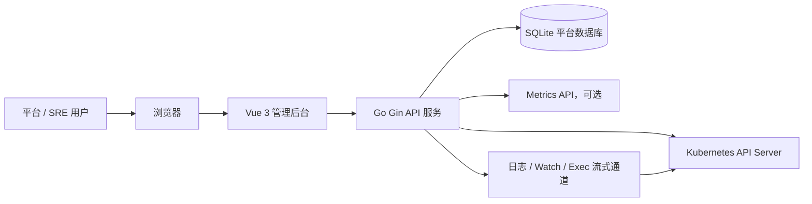
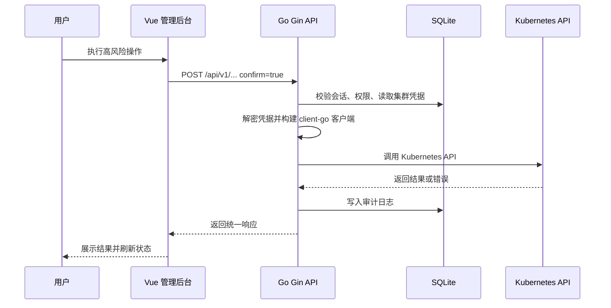

# 架构设计

## 1. 文档信息

- 项目名称：kube-subops
- 文档版本：1.0.0
- 作者：Codex
- 创建日期：2026-05-27
- 最后更新日期：2026-05-27
- 文档状态：已确认
- 项目类型：全栈应用

## 2. 系统总览

### 系统简介

kube-subops 是面向平台 / SRE 团队的 Kubernetes Web 管理平台，用于通过浏览器统一连接、查看和管理多个 Kubernetes 集群，并提供平台 RBAC、敏感凭据保护、高风险操作确认和本地审计能力。

### 架构目标

- 目标 1：以单体 Web 控制台形态交付，支持 Docker Compose 单实例部署和平台数据持久化。
- 目标 2：通过 Go 后端统一代理 Kubernetes API，前端不直接访问集群 API Server，也不保存集群凭据。
- 目标 3：以模块化方式承载多集群、全资源管理、日志终端、YAML 管理、权限审计和系统设置。
- 目标 4：为后续 UI 模板交接、前后端开发和一致性检查建立稳定 API、数据库和任务基线。

### 范围与关键约束

- 本次包含：Web 管理后台、Go API 服务、SQLite 平台数据库、Kubernetes API 直连代理、服务端会话、平台 RBAC、凭据加密、审计、日志与终端流式通道。
- 本次不包含：Helm Chart、集群内 Agent、外部 OIDC / LDAP / AD、外部 SIEM / Webhook、桌面客户端、移动 App、PWA、备份恢复脚本。
- 关键约束：SQLite 仅作为 v1.0 单实例 Compose 主库，不承诺多实例高可用、高并发写入或大规模审计长期增长；后续生产强化可迁移 PostgreSQL。

详细需求范围以 `spec/需求文档.md` 为准，本节只保留影响架构判断的摘要。

## 3. 技术选型与边界

### 技术选型总览

| 类别 | 方案 | 说明 |
|------|------|------|
| 前端 | Vue 3 + TypeScript + Vite | Vue 管理后台技术路径，精确依赖版本待 `/ui` 选定模板后从模板 facts / package.json / lockfile 确认 |
| 前端组成清单 | Vue 3、TypeScript、Vite、Vue Router、Pinia、REST 请求层、Tailwind CSS 或模板确认的样式体系 | 当前阶段不选择具体模板 ID |
| 后端 | Go + Gin + client-go | Gin 负责 REST API、中间件和流式通道入口；client-go 负责访问 Kubernetes API |
| API | REST + WebSocket / SSE | 普通业务使用 REST + JSON；Pod exec 使用 WebSocket；日志、watch 类能力可使用 SSE 或 WebSocket |
| 数据库阶段策略 | SQLite + sqlc + goose | SQLite 为 v1.0 主库；sqlc 生成类型安全查询；goose 管理迁移；PostgreSQL 为后续生产增强方向 |
| 缓存 / 队列 / 文件存储 | 暂不引入 | 首版无独立 Redis、队列或对象存储；多实例会话、长任务或附件能力出现时再评估 |
| 部署方式 | Docker Compose | 当前只确认交付模型，具体 Compose、`.env.example` 和部署脚本由 `/deploy` 生成 |
| 版本锁定来源 | Vue 3、Go、Gin、SQLite、client-go 为技术路径；精确版本待工程初始化与依赖文件确认 | 不在架构阶段臆造精确依赖版本 |

### 技术取舍

- 采用当前方案的原因：Vue 管理后台适合内部控制台和模板驱动 UI；Go + client-go 对 Kubernetes API 生态更原生；SQLite 降低首版 Compose 部署复杂度；sqlc + goose 让数据契约显式、迁移可控。
- 替代方案与取舍：React + TanStack 更适合极复杂表格但用户已确认 Vue；NestJS 便于全栈 TypeScript 但 Kubernetes 生态原生度不如 Go；PostgreSQL 更适合生产多用户和审计增长但首版用户确认 SQLite 快速版。
- 候选池摘要：已比较 Vue / React 管理后台入口、Node.js / Go / FastAPI 后端和 SQLite / PostgreSQL 数据策略；本项目最终确认 Vue + Go + SQLite。
- 主要代价或风险：SQLite 单实例能力边界、审计数据增长、Go 后端与 Vue 前端 DTO 同步成本、Kubernetes 版本差异和流式终端稳定性。
- 技术栈选择历史：2026-05-27 确认 Vue 管理后台、Go 服务、SQLite 快速版、Gin、sqlc + goose、服务端会话 + AES-GCM。

### 前端落地边界 / 模板交接边界

- 架构阶段只确认前端技术栈、应用边界、接口风格和数据策略，不在本阶段选择或扫描本地模板源码。
- 前端模板选择、页面映射、当前业务命中的 catalog 能力映射和路由裁剪清单由 `/ui` 阶段输出到 `spec/UI原型设计.md`。
- 当前项目需要前端工程，`/dev-frontend` 默认先基于 `/ui` 已确认的源码基座模板复制到 `frontend/`，再在复制后的真实模板代码上进行业务改造。
- `frontend/` 的请求层、Mock、状态管理和接口接线应优先复用模板已有的 API / service / request / mock / adapter 结构；禁止绕过模板基线重新 DIY 第二套前端请求体系。

## 4. 系统边界与总体架构

### 系统边界

- 系统负责：内置账号登录、服务端会话、平台 RBAC、多集群连接配置、集群凭据加密、Kubernetes API 代理、资源列表与详情、YAML 管理、工作负载操作、Pod 日志与终端、Node 操作、审计日志、系统设置。
- 系统不负责：目标集群创建、集群内 Agent 安装、Helm 交付、外部 SSO、外部审计系统、备份恢复脚本、跨网络隧道、移动端和桌面端。
- 外部依赖：目标 Kubernetes API Server、目标集群 Metrics API / metrics-server（可选）、浏览器、Docker Compose 运行环境、后端环境主密钥。

### 总体架构图

### 分层与核心模块

| 模块 / 层级 | 职责 | 依赖 | 当前状态 |
|-------------|------|------|----------|
| Vue 管理后台 | 登录、导航、资源页面、表单、YAML、日志、终端、系统设置 | `/api/v1`、UI 模板事实源 | 未开始 |
| API 网关与中间件 | 路由、会话、权限、审计上下文、错误响应、请求 ID | Gin、sessions、RBAC | 未开始 |
| 认证与会话 | 登录、退出、当前用户、服务端会话撤销和过期 | users、sessions | 未开始 |
| 平台 RBAC | 用户、角色、权限点、集群和 Namespace 授权范围 | roles、permissions、cluster_access_scopes | 未开始 |
| 集群管理 | 集群配置、连接测试、凭据加密保存、客户端初始化 | clusters、cluster_credentials、AES-GCM | 未开始 |
| Kubernetes 客户端工厂 | 根据集群凭据构建 client-go 客户端，封装版本和权限失败 | client-go、凭据解密 | 未开始 |
| 资源通用管理 | 资源列表、详情、YAML、创建、编辑、删除、筛选分页 | Kubernetes API | 未开始 |
| 专项运维操作 | 工作负载扩缩容/重启/镜像/回滚，Pod 日志/终端，Node drain | Kubernetes API、流式通道 | 未开始 |
| 审计模块 | 记录登录、集群连接、资源写操作、高风险操作和失败原因 | audit_logs | 未开始 |
| 系统设置 | 平台配置、审计保留周期、安全配置 | system_settings | 未开始 |

## 5. 关键流程摘要

| 流程 | 触发条件 | 关键参与方 | 架构关注点 |
|------|----------|------------|------------|
| 用户登录 | 用户提交账号密码 | 前端、Go API、SQLite | 密码校验、服务端会话、httpOnly Cookie、审计 |
| 添加集群 | 管理员提交 kubeconfig / Token | 前端、Go API、SQLite、Kubernetes API | 凭据加密、连接测试、错误脱敏、审计 |
| 资源查看 | 用户打开资源列表或详情 | 前端、Go API、Kubernetes API | 平台 RBAC、命名空间范围、Kubernetes 权限错误降级 |
| YAML 应用 | 用户编辑并确认应用 YAML | 前端、Go API、Kubernetes API、审计 | 高风险确认、权限复核、API 失败反馈 |
| Pod 终端 | 用户进入容器终端 | 前端、Go API、Kubernetes API | WebSocket、二次确认、会话权限、审计 |
| Secret 明文查看 | 用户确认查看 Secret | 前端、Go API、Kubernetes API、审计 | 权限复核、明文短暂返回、不长期缓存 |
| Node drain | 用户执行节点 drain | 前端、Go API、Kubernetes API、审计 | 高风险确认、长过程状态、失败原因 |

## 6. 契约与数据事实源引用

| 事实源 | 路径 | 架构侧只保留什么 |
|--------|------|------------------|
| API 设计 | `spec/API设计.md` | 接口风格、认证方式、版本策略和联调边界摘要 |
| 数据库设计 | `spec/数据库设计.md` | 主数据库、核心数据域、存储边界和一致性摘要 |
| UI 原型设计 | `spec/UI原型设计.md` | 模板选择结果、页面映射和前端交接边界摘要 |
| 开发计划 | `spec/开发计划.md` | 阶段顺序和任务基线引用 |
| 开发进度 | `spec/开发进度.md` | 当前阶段和完成状态引用 |

## 7. 部署与非功能约束

### 部署运行摘要

- 环境划分：本地开发、Docker Compose 单实例运行环境。
- 部署方式：首版交付 Docker Compose；具体 Compose、Dockerfile、`.env.example`、初始化脚本由 `/deploy` 在实现后生成。
- 运行依赖：Go API 服务、Vue 静态资源服务或前端构建产物、SQLite 数据卷、后端环境主密钥、可访问目标 Kubernetes API Server 的网络。
- 健康检查：后端应提供健康检查接口；运行态端口、进程和日志由 `/ops` 与 `spec/运行状态.md` 维护。

### 非功能约束摘要

| 类型 | 关键约束 | 验证方式 / 后续事实源 |
|------|----------|------------------------|
| 性能 | 资源列表应分页，日志和 watch 使用流式通道；避免一次性拉取全量大对象 | API 设计、后端实现和检查报告 |
| 可用性 | SQLite 单实例运行，服务异常不应损坏凭据和审计数据 | 数据库设计、运行状态 |
| 安全 | httpOnly Cookie、服务端会话、AES-GCM 凭据加密、高风险操作二次确认、后端权限复核 | API 设计、数据库设计、检查报告 |
| 可维护性 | API、数据库、UI、计划和进度分别维护独立事实源 | `spec/*` 文档 |

运行态启停、端口、进程、日志、健康检查记录由 `/ops` 和 `spec/运行状态.md` 维护；本节只写架构级约束。

## 8. 风险、待确认项与阶段交接

### 当前风险

| 风险 | 类型 | 影响 | 缓解措施 | 是否阻塞下一阶段 |
|------|------|------|----------|------------------|
| SQLite 审计数据增长 | 技术 | 中 | 首版限制为单实例轻量部署，设计审计保留周期，后续生产增强迁移 PostgreSQL | 否 |
| 目标集群网络不可达 | 运维 | 高 | 添加集群时提供连接测试和明确错误提示；跨网络和 Agent 模式延期 | 否 |
| Kubernetes 版本差异 | 第三方 | 中 | 通过 client-go 封装资源访问，错误透传并脱敏；后续实现阶段做兼容测试 | 否 |
| Pod exec / 日志流稳定性 | 技术 | 中 | 使用 WebSocket / SSE 边界，记录断开和失败原因 | 否 |
| 凭据主密钥丢失 | 安全 | 高 | 后续部署阶段明确主密钥配置和备份提示；不把真实密钥提交仓库 | 否 |

### 待确认项

- `/ui` 需要确认 Vue 管理后台源码基座模板、页面映射、组件复用和模板 API 适配基线。
- `/deploy` 需要在实现后确认 `.env.example`、Docker Compose、数据卷、主密钥配置和启动脚本。

### 当前开发状态

- 已开发：需求文档和架构规划事实源。
- 未开发：前端工程、后端工程、数据库迁移、API 实现、UI 设计、检查报告和运行态。
- 必做项：进入 `/ui` 完成模板选择与页面交接；之后再进入前端/后端实现阶段。
- 当前主线阶段：架构设计阶段完成后进入 UI 设计阶段。
- 下一默认阶段：`/ui`
